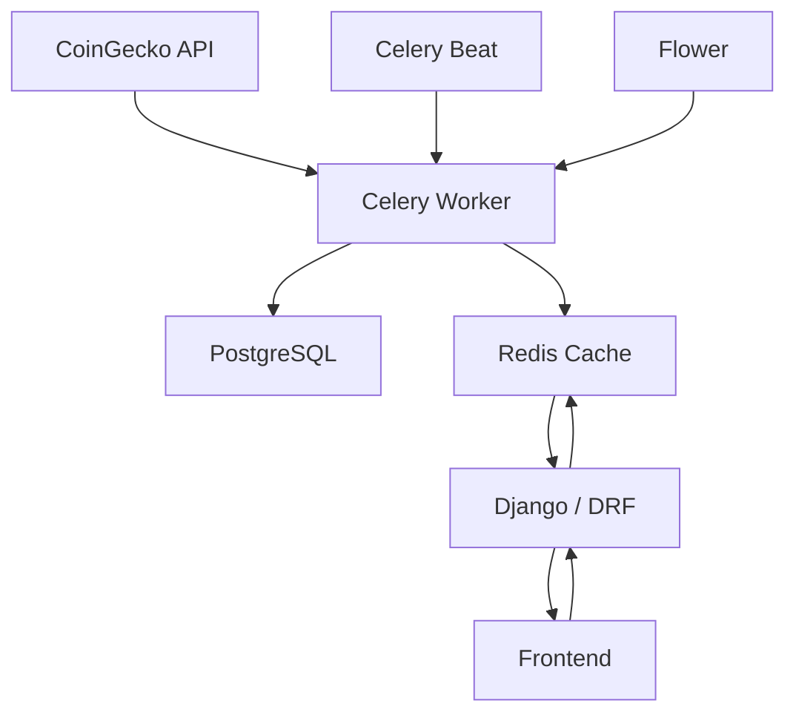
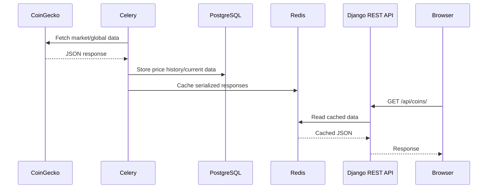

# Market

Cryptocurrency market dashboard built with Django REST Framework. The app collects market data from CoinGecko, stores it in PostgreSQL, caches ready-to-serve responses in Redis, and updates the data in the background with Celery.

## Tech Stack

- Python 3.11, Django, Django REST Framework
- PostgreSQL, Redis
- Celery, Celery Beat, Flower
- HTML, CSS, JavaScript, Alpine.js
- Docker, Docker Compose
- Swagger / OpenAPI
- CoinGecko API

## Getting Started

```bash
git clone https://github.com/RayGo28/Market.git
cd Market
cp backend/.env.example backend/.env
```

Set your `COINGECKO_API_KEY` in `backend/.env`, then start the containers:

```bash
docker compose up --build -d
docker compose exec web python manage.py migrate
docker compose exec web python manage.py fetch_coins
```
Open:

- App: `http://localhost:8000`
- Swagger: `http://localhost:8000/api/docs/`
- Flower: `http://localhost:5555`

## Features

- Cryptocurrency market overview and coin details
- Search, filtering, sorting and pagination
- Historical price data and market statistics
- REST API with OpenAPI documentation
- Redis response caching
- Background market updates with Celery
- Automatic cleanup of price history older than 30 days

---

## Architecture



## Data Flow



## Caching

The application caches serialized API data in Redis so normal reads do not repeatedly query PostgreSQL or run DRF serialization.

- `coin_list_cache` — market overview data
- `coin_detail_<gecko_id>` — detailed data for an individual coin
- `global_data` — global market statistics

Cache data is refreshed by background synchronization tasks and also rebuilt by the API when a cache entry is missing.

## Background Tasks

| Task | Schedule | Purpose |
| --- | --- | --- |
| `update_market_data` | Every 120s | Fetch market data, store history/current values and refresh the coin-list cache |
| `update_global_data` | Every 600s | Fetch and cache global market statistics |
| `cleanup_old_data` | Daily | Remove price history older than 30 days |

Celery retries CoinGecko requests on request errors with exponential backoff and up to three retries.

## REST API

| Method | Endpoint | Description |
| --- | --- | --- |
| `GET` | `/api/coins/` | List coins, with optional search |
| `GET` | `/api/coins/<gecko_id>/` | Coin details, history and statistics |
| `GET` | `/api/global/` | Global market statistics |
| `GET` | `/api/schema/` | OpenAPI schema |
| `GET` | `/api/docs/` | Swagger UI |

The main page refreshes market and global data through HTTP requests every 5 seconds, while the backend itself updates the source data on a slower Celery schedule. This keeps the client responsive without making CoinGecko requests per user.

## Project Structure

```text
Market/
├── backend/
│   ├── config/              # Django settings and Celery configuration
│   ├── core/
│   │   ├── management/      # Custom management commands
│   │   ├── services/        # CoinGecko integration, selectors, data sync
│   │   ├── static/           # Frontend JavaScript and CSS
│   │   ├── templates/        # Django templates
│   │   ├── models.py
│   │   ├── serializers.py
│   │   ├── urls.py
│   │   └── views.py
│   └── watcher/              # Celery tasks
├── docker-compose.yml
└── README.md
```

## Design Notes

The project separates responsibilities between Django API/views, service-layer data access and synchronization, Celery background processing, PostgreSQL persistence, and Redis caching. `PriceHistory` stores historical snapshots, while `CoinCurrentData` keeps the latest state for fast overview/detail queries.

The frontend handles presentation concerns such as sorting, filtering and pagination, while the backend exposes a documented read-only API for the market data.
